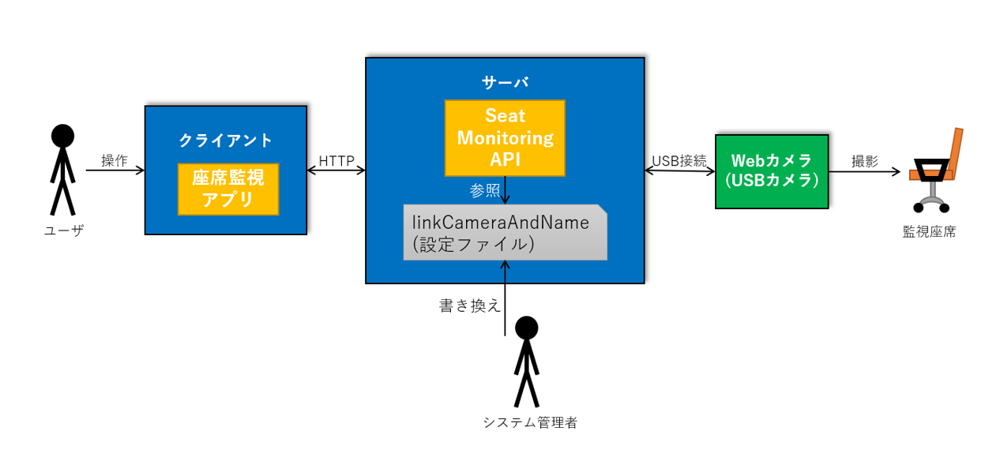

# システムの概要

## 目次

- [システムの概要](#%e3%82%b7%e3%82%b9%e3%83%86%e3%83%a0%e3%81%ae%e6%a6%82%e8%a6%81)
  - [目次](#%e7%9b%ae%e6%ac%a1)
  - [システムの全体像](#%e3%82%b7%e3%82%b9%e3%83%86%e3%83%a0%e3%81%ae%e5%85%a8%e4%bd%93%e5%83%8f)
    - [座席監視アプリ (.exe)](#%e5%ba%a7%e5%b8%ad%e7%9b%a3%e8%a6%96%e3%82%a2%e3%83%97%e3%83%aa-exe)
    - [Seat Monitoring API (WebAPI)](#seat-monitoring-api-webapi)
    - [linkCameraAndName (.csv)](#linkcameraandname-csv)
    - [confirmDevicePath (.exe)](#confirmdevicepath-exe)
    - [動作環境](#%e5%8b%95%e4%bd%9c%e7%92%b0%e5%a2%83)
    - [Webカメラ](#web%e3%82%ab%e3%83%a1%e3%83%a9)
    - [補足](#%e8%a3%9c%e8%b6%b3)

## システムの全体像

本システムは下図のような2つのアプリケーションとデバイスから構成される。

### 座席監視アプリ (.exe)

- 本システムのユーザが操作するGUIアプリケーション
- サーバへはアプリケーションの.configファイルでIPアドレスを指定し、HTTP通信で接続する
- ユーザはこのアプリケーションが提供する画面を見ることで監視座席の状態を確認可能

### Seat Monitoring API (WebAPI)

- 本システムで監視座席の状態を判定するアプリケーション
- 起動時にlinkCameraAndName.csvファイルを読み込み、カメラのデバイスパスと対応する座席名を持つ
- IIS(インターネットインフォメーションサービス)上で動作する

### linkCameraAndName (.csv)

- Seat Monitoring APIの設定ファイル
- カメラのデバイスパスと対応する座席名を定義する
- システム管理者はカメラの台数・設置場所・接続USBポートを変更したとき、confirmDevicePath.exeをもとにこのファイルを書き換える
- サーバPCの `C:\座席監視システム\システム管理者` フォルダに置く

### confirmDevicePath (.exe)

- 接続されているカメラのデバイスパスを取得し、カメラの映像とともに表示するGUIアプリケーション
- サーバPCの `C:\座席監視システム\システム管理者` フォルダに置く

### 動作環境

|クライアント、サーバ共通||
|:--|:--|
|OS|Windows10 Pro|
|CPU|3.20GHz以上|
|メモリ|8.0GB以上|
|ネットワーク|R-WANに接続|

### Webカメラ

logicool HD Webcam C525

### 補足

- 1つのWebカメラに対して1つの座席を監視する
- クライアントは定期的にサーバに画像を判定してもらい、その結果を表示し続ける
- クライアントは全ての監視座席の判定結果を表示する
