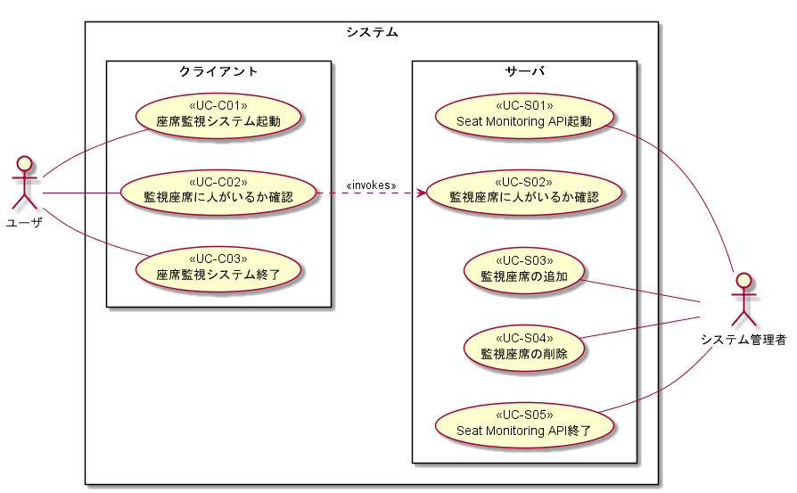

# 機能仕様/ユースケース仕様

## 目次

- [機能仕様/ユースケース仕様](#%e6%a9%9f%e8%83%bd%e4%bb%95%e6%a7%98%e3%83%a6%e3%83%bc%e3%82%b9%e3%82%b1%e3%83%bc%e3%82%b9%e4%bb%95%e6%a7%98)
  - [目次](#%e7%9b%ae%e6%ac%a1)
  - [ユースケース図](#%e3%83%a6%e3%83%bc%e3%82%b9%e3%82%b1%e3%83%bc%e3%82%b9%e5%9b%b3)
  - [機能詳細](#%e6%a9%9f%e8%83%bd%e8%a9%b3%e7%b4%b0)
    - [サーバ側](#%e3%82%b5%e3%83%bc%e3%83%90%e5%81%b4)
      - [Seat Monitoring API起動](#seat-monitoring-api%e8%b5%b7%e5%8b%95)
      - [監視座席の状態確認](#%e7%9b%a3%e8%a6%96%e5%ba%a7%e5%b8%ad%e3%81%ae%e7%8a%b6%e6%85%8b%e7%a2%ba%e8%aa%8d)
      - [監視座席の追加](#%e7%9b%a3%e8%a6%96%e5%ba%a7%e5%b8%ad%e3%81%ae%e8%bf%bd%e5%8a%a0)
      - [監視座席の削除](#%e7%9b%a3%e8%a6%96%e5%ba%a7%e5%b8%ad%e3%81%ae%e5%89%8a%e9%99%a4)
      - [Seat Monitoring API終了](#seat-monitoring-api%e7%b5%82%e4%ba%86)
  - [
](#hr)
    - [クライアント側](#%e3%82%af%e3%83%a9%e3%82%a4%e3%82%a2%e3%83%b3%e3%83%88%e5%81%b4)
      - [座席監視アプリ起動](#%e5%ba%a7%e5%b8%ad%e7%9b%a3%e8%a6%96%e3%82%a2%e3%83%97%e3%83%aa%e8%b5%b7%e5%8b%95)
      - [監視座席に人がいるか確認](#%e7%9b%a3%e8%a6%96%e5%ba%a7%e5%b8%ad%e3%81%ab%e4%ba%ba%e3%81%8c%e3%81%84%e3%82%8b%e3%81%8b%e7%a2%ba%e8%aa%8d)
        - [画面仕様](#%e7%94%bb%e9%9d%a2%e4%bb%95%e6%a7%98)
      - [座席監視アプリの終了](#%e5%ba%a7%e5%b8%ad%e7%9b%a3%e8%a6%96%e3%82%a2%e3%83%97%e3%83%aa%e3%81%ae%e7%b5%82%e4%ba%86)

## ユースケース図

本システムは以下のユースケースを持つ。

## 機能詳細

### サーバ側

#### Seat Monitoring API起動

||||
|:--|:--|:--|
|機能ID/UCID||FR-S01/UC-S01|
|UC名称||Seat Monitoring API起動|
|仕様|アクター|システム管理者|
||トリガー|サーバPCの起動|
||概要|サーバPCの起動後、自動でSeat Monitoring APIが起動する|
||事前条件|初期画面が表示されている|
||基本フロー|1. サーバPCを起動する   2. Seat Monitoring APIが起動する   3. linkDevicepathAndName.csvを読み込みカメラのモニカと名前のリストを作成する|
||代替フロー|1. Webサーバを起動する|
||例外フロー|なし|
||事後条件|Seat Monitoring APIが起動している|
|補足||linkDevicepathAndName.csvの詳細については[データ仕様](データ仕様.md)に記載   linkDevicepathAndName.csvが読み込めなかった場合、Seat Monitoring APIが終了する|

---

#### 監視座席の状態確認

||||
|:--|:--|:--|
|機能ID/UCID||FR-S02/UC-S02|
|UC名称||監視座席に人がいるか確認|
|仕様|アクター|機能ID:FR03(監視座席の状態表示)|
||トリガー|座席監視システムからの呼び出し|
||概要|座席監視システムが指定するWebカメラから画僧を取得し、監視座席の状態を座席監視システムに返す|
||事前条件|Seat Monitoring APIが起動している|
||基本フロー|1. 座席監視システムに呼び出される   2. クライアントが指定するWebカメラから画像を取得   3. 画像に人がいるorいないを判断   4. クライアントに結果を返す|
||代替フロー|指定されたWebカメラを認識できない場合   1. Webカメラが見つからない旨のエラーを返す|
||例外フロー|なし|
||事後条件|Seat Monitoring APIが起動している|
|補足||Seat Monitoring APIの詳細については[WebAPI仕様](WebAPI仕様.md)に記載|

---

#### 監視座席の追加

||||
|:--|:--|:--|
|機能ID/UCID||FR-S03/UC-S03|
|UC名称||監視座席の追加|
|仕様|アクター|システム管理者|
||トリガー|監視座席の追加|
||概要|サーバPCにWebカメラを追加で接続し、監視座席を追加する|
||事前条件|サーバPCが起動している|
||基本フロー|1. Webカメラを接続する   2. confirmDevicePath.exeを使用して接続したWebカメラのモニカを確認する   3. linkDevicepathAndName.csvファイルを書き換える   4. Seat Monitoring APIを再起動する|
||代替フロー|なし|
||例外フロー|なし|
||事後条件|Seat Monitoring APIが起動している|
|補足||confirmDevicePath.exeの詳細については[画面概要](画面概要.md\#confirmdevicepath)に、linkDevicepathAndName.csvの詳細については[データ仕様](データ仕様.md)にそれぞれ記載|

---

#### 監視座席の削除

||||
|:--|:--|:--|
|機能ID/UCID||FR-S04/UC-S04|
|UC名称||監視座席の削除|
|仕様|アクター|システム管理者|
||トリガー|監視座席の削除|
||概要|サーバPCにWebカメラの接続を解除し、監視座席を削除する|
||事前条件|サーバPCが起動している|
||基本フロー|1. Webカメラの接続を解除する   2. confirmDevicePath.exeを使用して接続されているWebカメラのモニカを確認する   3. linkDevicepathAndName.csvファイルを書き換える   4. Seat Monitoring APIを再起動する|
||代替フロー|なし|
||例外フロー|なし|
||事後条件|Seat Monitoring APIが起動している|
|補足||confirmDevicePath.exeの詳細については[画面概要](画面概要.md\#confirmdevicepath)に、linkDevicepathAndName.csvの詳細については[データ仕様](データ仕様.md)にそれぞれ記載|

---

#### Seat Monitoring API終了

||||
|:--|:--|:--|
|機能ID/UCID||FR-S05/UC-S05|
|UC名称||Seat Monitoring APIの終了|
|仕様|アクター|システム管理者|
||トリガー|サーバPCの起動|
||概要|サーバPCのシャットダウン時、自動でSeat Monitoring APIが終了する|
||事前条件|Seat Monitoring APIが起動している|
||基本フロー|1. サーバPCをシャットダウンする|
||代替フロー|1. Webサーバを停止する|
||例外フロー|なし|
||事後条件|Seat Monitoring APIが終了している|
|補足||なし|

---
---

### クライアント側

#### 座席監視アプリ起動

||||
|:--|:--|:--|
|機能ID/UCID||FR-C01/UC-C01|
|UC名称||座席監視アプリ起動|
|仕様|アクター|ユーザ|
||トリガー|実行ファイルを指定してアプリケーションを起動|
||概要|アプリケーションを起動し、初期画面を表示する|
||事前条件|Seat Monitoring APIが起動している|
||基本フロー|1. 実行ファイルを指定してアプリケーションを起動する   2. 初期画面が表示される   3. Seat Monitoring APIから監視座席名のリストを取得する|
||代替フロー|なし|
||例外フロー|Seat Monitoring APIを叩けない場合   1. エラー画面を表示する   2. 「OK」ボタン押下でアプリケーションを終了する|
||事後条件|初期画面が表示されている|
|補足||Seat Monitoring APIの詳細については[WebAPI仕様](WebAPI仕様.md)に記載|

---

#### 監視座席に人がいるか確認

||||
|:--|:--|:--|
|機能ID/UCID||FR-C02/UC-C02|
|UC名称||監視座席に人がいるか確認|
|仕様|アクター|ユーザ|
||トリガー|「監視開始」ボタン押下|
||概要|1分毎にSeat Monitoring APIから監視座席の状態を取得し、監視画面に表示する|
||事前条件|初期画面が表示されている|
||基本フロー|1. Seat Monitoring APIから監視座席の状態を取得する   2. 監視画面に取得結果を表示する|
||代替フロー|監視座席の状態取得に失敗した場合   1. 状態を「エラー」として監視画面に表示する|
||例外フロー|Seat Monitoring APIが叩けない場合   1. エラー画面を表示する   2. 「OK」ボタン押下でアプリケーションを終了する|
||事後条件|監視画面が表示される|
|補足||Seat Monitoring APIの詳細については[WebAPI仕様](WebAPI仕様.md)に記載|

##### 画面仕様

---

#### 座席監視アプリの終了

||||
|:--|:--|:--|
|機能ID/UCID||FR-C03/UC-C03|
|UC名称||座席監視アプリの終了|
|仕様|アクター|ユーザ|
||トリガー|「アプリ終了」ボタン押下|
||概要|アプリケーションを終了する|
||事前条件|初期画面が表示されている|
||基本フロー|1. 初期画面の「アプリ終了」ボタンを押下する   2. 初期画面が閉じられ、座席監視アプリが終了する|
||代替フロー|なし|
||例外フロー|なし|
||事後条件|初期画面が閉じられ、座席監視アプリが終了している|
|補足||なし|

---
