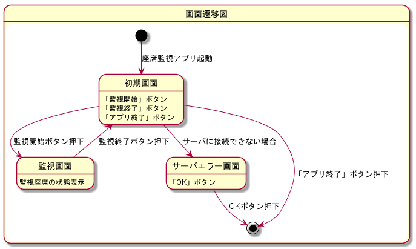

# 画面概要  

## 目次

- [画面概要](#%e7%94%bb%e9%9d%a2%e6%a6%82%e8%a6%81)
  - [目次](#%e7%9b%ae%e6%ac%a1)
  - [座席監視アプリ](#%e5%ba%a7%e5%b8%ad%e7%9b%a3%e8%a6%96%e3%82%a2%e3%83%97%e3%83%aa)
    - [画面仕様](#%e7%94%bb%e9%9d%a2%e4%bb%95%e6%a7%98)
      - [監視画面](#%e7%9b%a3%e8%a6%96%e7%94%bb%e9%9d%a2)
      - [サーバエラー画面](#%e3%82%b5%e3%83%bc%e3%83%90%e3%82%a8%e3%83%a9%e3%83%bc%e7%94%bb%e9%9d%a2)
        - [補足](#%e8%a3%9c%e8%b6%b3)
    - [画面遷移図](#%e7%94%bb%e9%9d%a2%e9%81%b7%e7%a7%bb%e5%9b%b3)
  - [confirmDevicePath](#confirmdevicepath)
    - [confirmDevicePath画面](#confirmdevicepath%e7%94%bb%e9%9d%a2)

## 座席監視アプリ

### 画面仕様

#### 監視画面

|No.|項目名|説明|
|:--|:--|:--|
|①|監視座席名表示領域|監視座席の名前を表示する。|
|②|監視座席状態表示領域|監視座席の状態を「いる」or「いない」で表示する。状態の取得に失敗した場合は「エラー」と表示する。|

#### サーバエラー画面

|No.|項目名|説明|
|:--|:--|:--|
|①|OKボタン|ボタンを押下すると座席監視アプリを終了する。|

##### 補足

- サーバエラー画面はモーダルで表示する

### 画面遷移図

---

## confirmDevicePath

### confirmDevicePath画面

|No.|項目名|説明|
|:--|:--|:--|
|①|映像表示領域|Webカメラで撮影している映像を表示する。|
|②|モニカ表示領域|映像に対応するWebカメラのモニカを表示する。|

補足

- Webカメラが10台未満の場合は認識された数の映像とモニカが表示される
- Webカメラが11台以上接続されている場合は認識した順番で10台分表示し、11台目以降は無視する
- Webカメラが1台も接続されていない場合はエラーにならず、①と②の表示が無い画面だけが表示される
