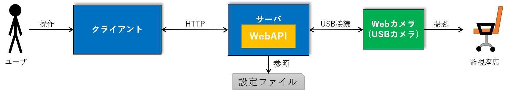
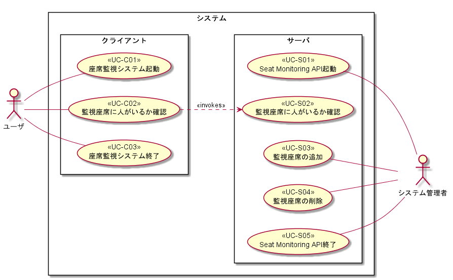
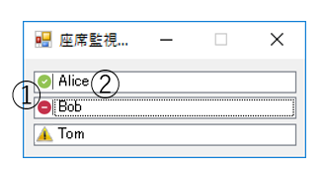
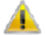

# 座席監視システム 機能仕様書

## 目次

- [座席監視システム 機能仕様書](#%e5%ba%a7%e5%b8%ad%e7%9b%a3%e8%a6%96%e3%82%b7%e3%82%b9%e3%83%86%e3%83%a0-%e6%a9%9f%e8%83%bd%e4%bb%95%e6%a7%98%e6%9b%b8)
  - [目次](#%e7%9b%ae%e6%ac%a1)
  - [1. 概要](#1-%e6%a6%82%e8%a6%81)
    - [1.1. 本書の目的](#11-%e6%9c%ac%e6%9b%b8%e3%81%ae%e7%9b%ae%e7%9a%84)
    - [1.2. 本書の記述内容](#12-%e6%9c%ac%e6%9b%b8%e3%81%ae%e8%a8%98%e8%bf%b0%e5%86%85%e5%ae%b9)
    - [1.3. 関連ドキュメント](#13-%e9%96%a2%e9%80%a3%e3%83%89%e3%82%ad%e3%83%a5%e3%83%a1%e3%83%b3%e3%83%88)
  - [2. 用語定義](#2-%e7%94%a8%e8%aa%9e%e5%ae%9a%e7%be%a9)
  - [3. システムの概要](#3-%e3%82%b7%e3%82%b9%e3%83%86%e3%83%a0%e3%81%ae%e6%a6%82%e8%a6%81)
    - [3.1. システムの全体像](#31-%e3%82%b7%e3%82%b9%e3%83%86%e3%83%a0%e3%81%ae%e5%85%a8%e4%bd%93%e5%83%8f)
      - [3.1.1. 座席監視アプリ (.exe)](#311-%e5%ba%a7%e5%b8%ad%e7%9b%a3%e8%a6%96%e3%82%a2%e3%83%97%e3%83%aa-exe)
      - [3.1.2. Seat Monitoring API (WebAPI)](#312-seat-monitoring-api-webapi)
      - [3.1.3.動作環境](#313%e5%8b%95%e4%bd%9c%e7%92%b0%e5%a2%83)
      - [3.1.4. Webカメラ](#314-web%e3%82%ab%e3%83%a1%e3%83%a9)
      - [3.1.5. 補足](#315-%e8%a3%9c%e8%b6%b3)
  - [4. 機能仕様/ユースケース仕様](#4-%e6%a9%9f%e8%83%bd%e4%bb%95%e6%a7%98%e3%83%a6%e3%83%bc%e3%82%b9%e3%82%b1%e3%83%bc%e3%82%b9%e4%bb%95%e6%a7%98)
    - [4.1. ユースケース図](#41-%e3%83%a6%e3%83%bc%e3%82%b9%e3%82%b1%e3%83%bc%e3%82%b9%e5%9b%b3)
    - [4.2. 機能詳細(サーバ側)](#42-%e6%a9%9f%e8%83%bd%e8%a9%b3%e7%b4%b0%e3%82%b5%e3%83%bc%e3%83%90%e5%81%b4)
      - [4.2.1. Seat Monitoring API起動](#421-seat-monitoring-api%e8%b5%b7%e5%8b%95)
      - [4.2.2. 監視座席の状態確認](#422-%e7%9b%a3%e8%a6%96%e5%ba%a7%e5%b8%ad%e3%81%ae%e7%8a%b6%e6%85%8b%e7%a2%ba%e8%aa%8d)
      - [4.2.3. 監視座席の追加](#423-%e7%9b%a3%e8%a6%96%e5%ba%a7%e5%b8%ad%e3%81%ae%e8%bf%bd%e5%8a%a0)
      - [4.2.4. 監視座席の削除](#424-%e7%9b%a3%e8%a6%96%e5%ba%a7%e5%b8%ad%e3%81%ae%e5%89%8a%e9%99%a4)
      - [4.2.5. Seat Monitoring API終了](#425-seat-monitoring-api%e7%b5%82%e4%ba%86)
    - [4.3. 機能詳細(クライアント側)](#43-%e6%a9%9f%e8%83%bd%e8%a9%b3%e7%b4%b0%e3%82%af%e3%83%a9%e3%82%a4%e3%82%a2%e3%83%b3%e3%83%88%e5%81%b4)
      - [4.3.1. 座席監視アプリ起動](#431-%e5%ba%a7%e5%b8%ad%e7%9b%a3%e8%a6%96%e3%82%a2%e3%83%97%e3%83%aa%e8%b5%b7%e5%8b%95)
      - [4.3.2. 監視座席に人がいるか確認](#432-%e7%9b%a3%e8%a6%96%e5%ba%a7%e5%b8%ad%e3%81%ab%e4%ba%ba%e3%81%8c%e3%81%84%e3%82%8b%e3%81%8b%e7%a2%ba%e8%aa%8d)
        - [4.3.2.1. 画面仕様](#4321-%e7%94%bb%e9%9d%a2%e4%bb%95%e6%a7%98)
        - [4.3.2.2. アイコン説明](#4322-%e3%82%a2%e3%82%a4%e3%82%b3%e3%83%b3%e8%aa%ac%e6%98%8e)
      - [4.3.3. 座席監視アプリの終了](#433-%e5%ba%a7%e5%b8%ad%e7%9b%a3%e8%a6%96%e3%82%a2%e3%83%97%e3%83%aa%e3%81%ae%e7%b5%82%e4%ba%86)
  - [5. データ仕様](#5-%e3%83%87%e3%83%bc%e3%82%bf%e4%bb%95%e6%a7%98)
    - [5.1. linkCameraAndName](#51-linkcameraandname)

## 1. 概要

### 1.1. 本書の目的

本書は以下の2点を目的としている。

- 座席監視システムがが提供すべき機能をどのように実現するのかを顧客の視点で明確にする事。
- 明確にした機能仕様に対し、直接の利害関係者と合意を形成する事。

### 1.2. 本書の記述内容

本書はユースケースを用いて座席監視システムの機能仕様を定義する。

### 1.3. 関連ドキュメント

- 本書は要件定義書をもとに作成・更新する

- 本書をもとに結合テスト仕様書を作成・更新する

---

## 2. 用語定義

本機能仕様書で扱う用語を以下で定義する。

|用語|意味|
|:--|:--|
|ユースケース|本機能仕様書では、ユースケースという技法を用いてシステムが備えるべき機能を把握する。ユースケースは顧客の視点から見た機能であり、何らかの目的を表現するものである。|
|アクター|アクターとは、システム外部からシステムのユースケースを用いる人やシステム、環境などである。|
|トリガー|トリガーとは、ユースケースを開始する条件であり、外部的条件（アクターによる操作など）や時間的条件（バッチ処理を2時に起動するなど）、内部的条件（ある状態に遷移したら自動的に行われるなど）がある。|
|事前条件|ユースケースを開始する時点で真となる条件である。一部でも真とならない場合には、ユースケースの動作は保証されない。|
|事後条件|ユースケースを終了した時点で真である条件である。|
|基本フロー|ユースケースの基本的なフロー。|
|代替フロー|ユースケースの基本的なフロー中、条件によって処理が分岐する場合に記述する。事後条件は満たされる。|
|例外フロー|ユースケースの実行を断念しなければならないような場合のフローを記述する。アクターから見えるシステムのエラーで、代替するフローがないもの。例外フローを実行した場合、事後条件は満たされない。|
|ユーザ|システムの利用者。|
|システム管理者|システムメンテナンスを行う人。|
|クライアント|ユーザに対して監視座席に人がいるかを伝えるサブシステムのこと。|
|サーバ|クライアントに対して監視座席に人がいるかを判定して伝えるサブシステムのこと。本システムは遠隔の情報をやりとりする必要があるため、サーバが必要となる。|
|監視座席|サーバからカメラで監視している座席。ユーザは本システムで監視座席に人がいるかを確認することができる。|
|モニカ|Webカメラを一意に識別できる。システム管理者が確認する。|
|監視座席名|監視座席を自席とする人の名前。システム管理者がカメラIDごとに設定する。|
|監視座席の状態|監視座席に人がいるかどうかを表す。|
|座席監視アプリ|ユーザが操作するクライアントアプリのこと。|
|Seat Monitoring API|監視座席の情報を取得するサーバアプリ(WebAPI)のこと。|
|linkCameraAndName|Seat Monitoring APIの設定ファイル(.csv形式)。Webカメラのモニカと監視座席名が入力されている。|
|confirmDevicePath|システム管理者がモニカを確認するためのアプリケーション。|

---

## 3. システムの概要

### 3.1. システムの全体像

本システムは下図のような2つのアプリケーションとデバイスから構成される。



#### 3.1.1. 座席監視アプリ (.exe)

- 本システムのユーザが操作するGUIアプリケーション
- サーバへはアプリケーションのapp.configファイルでkeyを「IPAddress」、valueにIPアドレスを指定し、HTTP通信で接続する
- app.configファイルはこのアプリケーションと同じディレクトリに置く
- ユーザはこのアプリケーションが提供する画面を見ることで監視座席の状態を確認可能

#### 3.1.2. Seat Monitoring API (WebAPI)

- 本システムで監視座席の状態を判定するアプリケーション
- IIS(インターネットインフォメーションサービス)上で動作する
- 起動時にlinkCameraAndName.csvファイルを読み込み、モニカと対応する座席名を持つ
  - linkCameraAndName (.csv)
    - Seat Monitoring APIの設定ファイル
    - モニカと対応する座席名を定義する
    - システム管理者はカメラの台数・設置場所・接続USBポートを変更したとき、システム管理者がこのファイルを書き換える
    - サーバPCの `C:\座席監視システム\システム管理者` フォルダに置く

#### 3.1.3.動作環境

|クライアント、サーバ共通||
|:--|:--|
|OS|Windows10 Pro|
|CPU|3.20GHz以上|
|メモリ|8.0GB以上|
|HDD|**T.B.D.**|
|ネットワーク|R-WANに接続|

#### 3.1.4. Webカメラ

USB接続が可能なカメラ(動作確認：logicool HD Webcam C525)

#### 3.1.5. 補足

- 1つのWebカメラに対して1つの座席を監視する
- クライアントは1分毎にサーバに画像を判定してもらい、その結果を表示し続ける
- クライアントは全ての監視座席の判定結果を表示する
- 座席管理アプリを多重起動した場合については保障しない
- 1台のサーバに対してクライアントは10台まで動作することを確認する
- 対応言語は日本語のみとする

## 4. 機能仕様/ユースケース仕様

### 4.1. ユースケース図

本システムは以下のユースケースを持つ。



### 4.2. 機能詳細(サーバ側)

#### 4.2.1. Seat Monitoring API起動

||||
|:--|:--|:--|
|機能ID/UCID||FR-S01/UC-S01|
|UC名称||Seat Monitoring API起動|
|仕様|アクター|システム管理者|
||トリガー|サーバPCの起動|
||概要|サーバPCの起動後、自動でSeat Monitoring APIが起動する|
||事前条件|アプリ画面が表示されている|
||基本フロー|1. サーバPCを起動する <br> 2. Seat Monitoring APIが起動する <br> 3. linkDevicepathAndName.csvを読み込みカメラのモニカと名前のリストを作成する|
||代替フロー|1. Webサーバを起動する|
||例外フロー|なし|
||事後条件|Seat Monitoring APIが起動している|
|補足||linkDevicepathAndName.csvについては[データ仕様](データ仕様.md)に記載 <br> linkDevicepathAndName.csvの詳細な設定方法は[linkCameraAndName設定手順書](linkCameraAndName設定手順書.md)を参照|

---

#### 4.2.2. 監視座席の状態確認

||||
|:--|:--|:--|
|機能ID/UCID||FR-S02/UC-S02|
|UC名称||監視座席に人がいるか確認|
|仕様|アクター|機能ID:FR03(監視座席の状態表示)|
||トリガー|座席監視システムからの呼び出し|
||概要|座席管理アプリから呼び出され、監視座席の状態を座席監視システムに返す|
||事前条件|Seat Monitoring APIが起動している|
||基本フロー|1. 座席監視アプリに呼び出される <br> 2. リストにある全てのカメラから画像を取得し、画像に人がいるorいないをそれぞれ判断する <br> 3. クライアントに結果を名前とtrueかfalseで返す|
||代替フロー|指定されたWebカメラを認識できない場合 <br> 1. true、falseではなくnullを返す|
||例外フロー|なし|
||事後条件|Seat Monitoring APIが起動している|
|補足||Seat Monitoring APIの詳細については[WebAPI仕様](WebAPI仕様.md)に記載|

---

#### 4.2.3. 監視座席の追加

||||
|:--|:--|:--|
|機能ID/UCID||FR-S03/UC-S03|
|UC名称||監視座席の追加|
|仕様|アクター|システム管理者|
||トリガー|監視座席の追加|
||概要|サーバPCにWebカメラを追加で接続し、監視座席を追加する|
||事前条件|サーバPCが起動している|
||基本フロー|1. Webカメラを接続する <br> 2. モニカと監視座席名を確認する <br> 3. linkDevicepathAndName.csvファイルを書き換える <br> 4. Seat Monitoring APIを再起動する|
||代替フロー|なし|
||例外フロー|なし|
||事後条件|Seat Monitoring APIが起動している|
|補足||linkDevicepathAndName.csvについては[データ仕様](データ仕様.md)に記載 <br> linkDevicepathAndName.csvの詳細な設定方法は[linkCameraAndName設定手順書](linkCameraAndName設定手順書.md)を参照|

---

#### 4.2.4. 監視座席の削除

||||
|:--|:--|:--|
|機能ID/UCID||FR-S04/UC-S04|
|UC名称||監視座席の削除|
|仕様|アクター|システム管理者|
||トリガー|監視座席の削除|
||概要|サーバPCにWebカメラの接続を解除し、監視座席を削除する|
||事前条件|サーバPCが起動している|
||基本フロー|1. Webカメラの接続を解除する <br> 2. モニカと監視座席名を確認する <br> 3. linkDevicepathAndName.csvファイルを書き換える <br> 4. Seat Monitoring APIを再起動する|
||代替フロー|なし|
||例外フロー|なし|
||事後条件|Seat Monitoring APIが起動している|
|補足||linkDevicepathAndName.csvについては[データ仕様](データ仕様.md)に記載 <br> linkDevicepathAndName.csvの詳細な設定方法は[linkCameraAndName設定手順書](linkCameraAndName設定手順書.md)を参照|

---

#### 4.2.5. Seat Monitoring API終了

||||
|:--|:--|:--|
|機能ID/UCID||FR-S05/UC-S05|
|UC名称||Seat Monitoring APIの終了|
|仕様|アクター|システム管理者|
||トリガー|サーバPCのシャットダウン|
||概要|サーバPCのシャットダウン時、自動でSeat Monitoring APIが終了する|
||事前条件|Seat Monitoring APIが起動している|
||基本フロー|1. サーバPCをシャットダウンする|
||代替フロー|1. Webサーバを停止する|
||例外フロー|なし|
||事後条件|Seat Monitoring APIが終了している|
|補足||なし|

---
<br>

### 4.3. 機能詳細(クライアント側)

#### 4.3.1. 座席監視アプリ起動

||||
|:--|:--|:--|
|機能ID/UCID||FR-C01/UC-C01|
|UC名称||座席監視アプリ起動|
|仕様|アクター|ユーザ|
||トリガー|実行ファイルを指定してアプリケーションを起動|
||概要|アプリケーションを起動し、アプリ画面を表示する|
||事前条件|Seat Monitoring APIが起動している|
||基本フロー|1. 実行ファイルを指定してアプリケーションを起動する <br> 2. アプリ画面が表示される|
||代替フロー|なし|
||例外フロー|なし|
||事後条件|アプリ画面が表示されている|
|補足||なし|

---

#### 4.3.2. 監視座席に人がいるか確認

||||
|:--|:--|:--|
|機能ID/UCID||FR-C02/UC-C02|
|UC名称||監視座席に人がいるか確認|
|仕様|アクター|ユーザ|
||トリガー|座席監視アプリの起動|
||概要|1分毎にSeat Monitoring APIから監視座席の状態を取得し、アプリ画面に表示・更新する|
||事前条件|Seat Monitoring APIが起動している|
||基本フロー|1. Seat Monitoring APIから監視座席の状態を取得する <br> 2. アプリ画面に取得結果を表示する|
||代替フロー|サーバ接続に失敗した場合 <br> 1. サーバに接続できないことを示すアイコンを表示する|
||例外フロー|なし|
||事後条件|なし(アプリ画面を更新し続ける)|
|補足||Seat Monitoring APIの詳細については[WebAPI仕様](WebAPI仕様.md)に記載|

##### 4.3.2.1. 画面仕様



アプリ画面

|No.|項目名|説明|
|:--|:--|:--|
|①|監視座席状態アイコン|監視座席の状態を表すアイコンを表示する|
|②|監視座席名表示領域|監視座席の名前を表示する。|

補足

- 画面はリサイズ不可とする
- 画面サイズ：**T.B.D.**

##### 4.3.2.2. アイコン説明


[ 在席アイコン ]

- 監視座席に人が「いる」状態を表すアイコン
- アイコンにマウスを翳すとtoolTipで「在席」と表示する


[ 離席アイコン ]

- 監視座席に人が「いない」状態を表するアイコン
- アイコンにマウスを翳すとtoolTipで「離席」と表示する



[ 状態取得失敗アイコン ]

- 監視座席の状態の取得に失敗した場合に表示するアイコン
- アイコンにマウスを翳すとtoolTipで「状態の取得に失敗しました」と表示する


[ サーバ接続エラーアイコン ]

- サーバ接続に失敗した場合に表示するアイコン
- アイコンにマウスを翳すとtoolTipで「サーバへの接続に失敗しました」と表示する

---

#### 4.3.3. 座席監視アプリの終了

||||
|:--|:--|:--|
|機能ID/UCID||FR-C03/UC-C03|
|UC名称||座席監視アプリの終了|
|仕様|アクター|ユーザ|
||トリガー|「閉じる」ボタン押下|
||概要|アプリケーションを終了する|
||事前条件|アプリ画面が表示されている|
||基本フロー|1. アプリ画面の「閉じる」ボタンを押下する <br> 2. アプリ画面が閉じられ、座席監視アプリが終了する|
||代替フロー|なし|
||例外フロー|なし|
||事後条件|アプリ画面が閉じられ、座席監視アプリが終了している|
|補足||なし|

---

## 5. データ仕様

### 5.1. linkCameraAndName

システム管理者が変更できるSeat Monitoring API用の設定ファイル。

|||
|:--|:--|
|形式|csvファイル|
|文字コード|UTF-8|
|Moniker|Webカメラのデバイスインスタンスパス(モニカ)|
|SeatName|監視座席名|
|補足|詳細な設定方法は[linkCameraAndName設定手順書](linkCameraAndName設定手順書.md)を参照|

例)

```CSV
"Moniker","SeatName"
"USB#VID_046D&PID_0826&MI_02#6&24bf100&0&0002","Alice"
"USB#VID_046D&PID_0826&MI_03#6&24bf100&0&0003","Bob"
```
