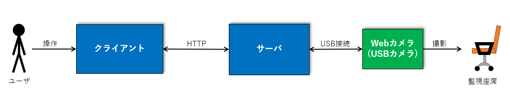
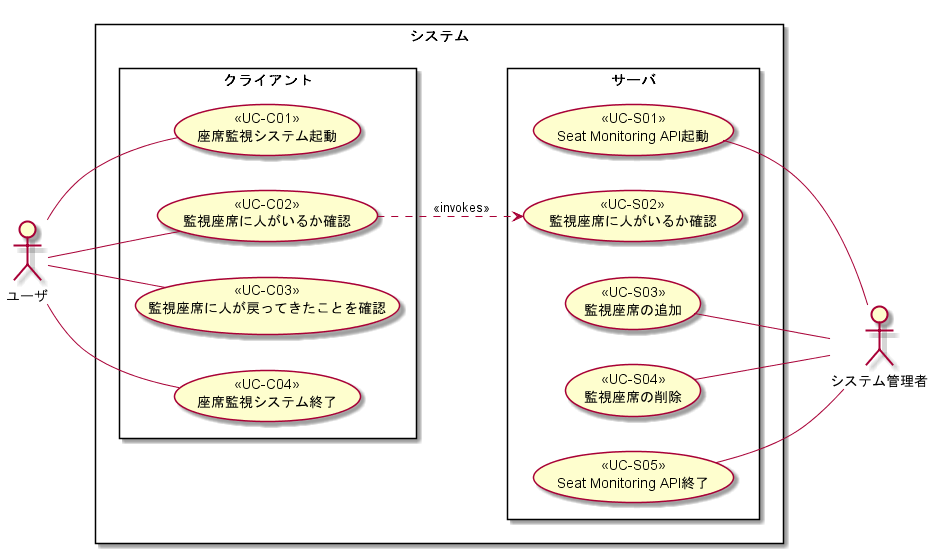
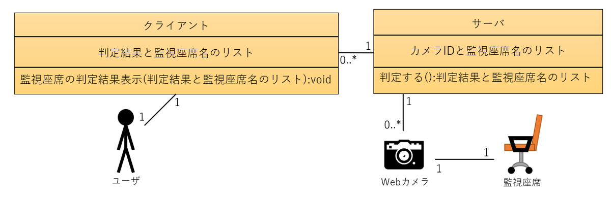

# 座席監視システム　要件定義書

## 目次

- [座席監視システム　要件定義書](#%e5%ba%a7%e5%b8%ad%e7%9b%a3%e8%a6%96%e3%82%b7%e3%82%b9%e3%83%86%e3%83%a0-%e8%a6%81%e4%bb%b6%e5%ae%9a%e7%be%a9%e6%9b%b8)
  - [目次](#%e7%9b%ae%e6%ac%a1)
  - [1. 概要](#1-%e6%a6%82%e8%a6%81)
    - [1.1. 本書の目的](#11-%e6%9c%ac%e6%9b%b8%e3%81%ae%e7%9b%ae%e7%9a%84)
    - [1.2. 用語の説明](#12-%e7%94%a8%e8%aa%9e%e3%81%ae%e8%aa%ac%e6%98%8e)
    - [1.3. 関連ドキュメント](#13-%e9%96%a2%e9%80%a3%e3%83%89%e3%82%ad%e3%83%a5%e3%83%a1%e3%83%b3%e3%83%88)
  - [2. システム開発の背景](#2-%e3%82%b7%e3%82%b9%e3%83%86%e3%83%a0%e9%96%8b%e7%99%ba%e3%81%ae%e8%83%8c%e6%99%af)
  - [3. 現状（As-Is）の業務と問題点](#3-%e7%8f%be%e7%8a%b6as-is%e3%81%ae%e6%a5%ad%e5%8b%99%e3%81%a8%e5%95%8f%e9%a1%8c%e7%82%b9)
    - [3.1. 業務一覧](#31-%e6%a5%ad%e5%8b%99%e4%b8%80%e8%a6%a7)
    - [3.2. 業務概要図](#32-%e6%a5%ad%e5%8b%99%e6%a6%82%e8%a6%81%e5%9b%b3)
    - [3.3. 業務の説明](#33-%e6%a5%ad%e5%8b%99%e3%81%ae%e8%aa%ac%e6%98%8e)
      - [3.3.1. 他フロアの従業員が自席にいるか確認する](#331-%e4%bb%96%e3%83%95%e3%83%ad%e3%82%a2%e3%81%ae%e5%be%93%e6%a5%ad%e5%93%a1%e3%81%8c%e8%87%aa%e5%b8%ad%e3%81%ab%e3%81%84%e3%82%8b%e3%81%8b%e7%a2%ba%e8%aa%8d%e3%81%99%e3%82%8b)
    - [3.4. 問題説明](#34-%e5%95%8f%e9%a1%8c%e8%aa%ac%e6%98%8e)
  - [4. 将来（To-Be）の業務](#4-%e5%b0%86%e6%9d%a5to-be%e3%81%ae%e6%a5%ad%e5%8b%99)
    - [4.1. 業務一覧](#41-%e6%a5%ad%e5%8b%99%e4%b8%80%e8%a6%a7)
    - [4.2. 業務概要図](#42-%e6%a5%ad%e5%8b%99%e6%a6%82%e8%a6%81%e5%9b%b3)
  - [4.3. 業務の説明](#43-%e6%a5%ad%e5%8b%99%e3%81%ae%e8%aa%ac%e6%98%8e)
    - [4.3.1. 他フロアの従業員が自席にいるか確認する](#431-%e4%bb%96%e3%83%95%e3%83%ad%e3%82%a2%e3%81%ae%e5%be%93%e6%a5%ad%e5%93%a1%e3%81%8c%e8%87%aa%e5%b8%ad%e3%81%ab%e3%81%84%e3%82%8b%e3%81%8b%e7%a2%ba%e8%aa%8d%e3%81%99%e3%82%8b)
  - [5. システムの概要](#5-%e3%82%b7%e3%82%b9%e3%83%86%e3%83%a0%e3%81%ae%e6%a6%82%e8%a6%81)
    - [5.1. システムの全体像](#51-%e3%82%b7%e3%82%b9%e3%83%86%e3%83%a0%e3%81%ae%e5%85%a8%e4%bd%93%e5%83%8f)
    - [5.2. システムの導入効果](#52-%e3%82%b7%e3%82%b9%e3%83%86%e3%83%a0%e3%81%ae%e5%b0%8e%e5%85%a5%e5%8a%b9%e6%9e%9c)
    - [5.3. 補足説明](#53-%e8%a3%9c%e8%b6%b3%e8%aa%ac%e6%98%8e)
  - [6. 提供ソリューションの基本要件](#6-%e6%8f%90%e4%be%9b%e3%82%bd%e3%83%aa%e3%83%a5%e3%83%bc%e3%82%b7%e3%83%a7%e3%83%b3%e3%81%ae%e5%9f%ba%e6%9c%ac%e8%a6%81%e4%bb%b6)
    - [6.1. 機能要件](#61-%e6%a9%9f%e8%83%bd%e8%a6%81%e4%bb%b6)
      - [6.1.1. ユースケース図](#611-%e3%83%a6%e3%83%bc%e3%82%b9%e3%82%b1%e3%83%bc%e3%82%b9%e5%9b%b3)
      - [6.1.2. ユースケース一覧](#612-%e3%83%a6%e3%83%bc%e3%82%b9%e3%82%b1%e3%83%bc%e3%82%b9%e4%b8%80%e8%a6%a7)
      - [6.1.3. アクター一覧](#613-%e3%82%a2%e3%82%af%e3%82%bf%e3%83%bc%e4%b8%80%e8%a6%a7)
      - [6.1.4. システム化の範囲](#614-%e3%82%b7%e3%82%b9%e3%83%86%e3%83%a0%e5%8c%96%e3%81%ae%e7%af%84%e5%9b%b2)
    - [6.2. データ要件](#62-%e3%83%87%e3%83%bc%e3%82%bf%e8%a6%81%e4%bb%b6)
    - [6.3. 非機能要件](#63-%e9%9d%9e%e6%a9%9f%e8%83%bd%e8%a6%81%e4%bb%b6)
    - [7. 納品物件](#7-%e7%b4%8d%e5%93%81%e7%89%a9%e4%bb%b6)

## 1. 概要

### 1.1. 本書の目的

座席監視システムが満たすべき要件は何か、何故それが必要かを明確にすること。

### 1.2. 用語の説明

|用語|意味|
|:--|:--|
|機能要件|業務実現に関する要件、業務に直結する要件のこと。|
|非機能要件|機能面以外の要件全般のこと。システムが持たなければならない固有の属性、質のことである。システム自体やその開発に対する制約事項である。|
|データ要件|業務で扱うデータに関する要件のこと。非機能要件のひとつであるが、本書では独立して扱う。|
|ユースケース|顧客の視点から見た機能のことであり、また、それを把握するための技法のこと。顧客が実現したいこと（目的）を表現するものであり、複数の機能要件を束ねることがある。システム利用者とのインタラクションによって対象システムが取り得る、状況に応じたさまざまな振る舞いとして表現される。|
|アクター|システム外部からシステムのユースケースを用いる人やシステム、環境などが該当する。|
|確認者|他フロアの従業員が自席にいるか確認したい人。|
|被確認者|確認者が確認したい人。|
|代理確認者|確認者の代理で被確認者が自席にいるか直接行って確かめる人。|
|利害関係者|システムの出力結果によって著しい影響を受ける人。|
|ユーザ|システムの利用者。|
|システム管理者|システムメンテナンスを行う人。|
|クライアント|ユーザに対して監視座席に人がいるかを伝えるサブシステムのこと。|
|サーバ|クライアントに対して監視座席に人がいるかを判定して伝えるサブシステムのこと。本システムは遠隔の情報をやりとりする必要があるため、サーバが必要となる。|
|監視座席|サーバからカメラで監視している座席。ユーザは本システムで監視座席に人がいるかを確認することができる
|カメラID|カメラを一意に識別できるID。システム管理者が割り当てる。|
|監視座席名|監視座席を自席とする人の名前。システム管理者がカメラIDごとに設定する。|

### 1.3. 関連ドキュメント

本書で明らかにした要件の実現方法は機能仕様書で定義し、テスト要件はシステム及び結合テスト仕様書で定義する。

---

## 2. システム開発の背景

居室のフロアが階を跨いでいるとする。従業員たちは他フロアの従業員が現在席にいるのか知りたいとき、以下の3つのアクションを取ることができる。

1. 直接座席に行って確認する
2. 内線やチャット、メールで直接本人に確認する
3. 内線やチャット、メールで目的の座席に近い人に確認する

1．の方法は3フロア分の移動時間がかかり、目的の人が座席にいなかったときにはフロアの往復をしなければならないため、非効率的である。2．3．の方法は相手の応答が無ければ達成できず、手間も応答までの時間もかかるため、こちらもやはり非効率的である。また、フリーで利用できる座席が設けられているが、そこが現在利用されているのか確認したい場合についても、上記1．3．の方法以外に取ることができるアクションが無い。上記の問題点を解決するため、本システムの開発を行う。

---

## 3. 現状（As-Is）の業務と問題点

### 3.1. 業務一覧

|業務名称|概要|備考|
|:--|:--|:--|
|他フロアの従業員が自席にいるか確認する。|以下の3つの方法がある   ・直接座席に行って確認する   ・内線やチャット、メールで本人に確認する   ・内線やチャット、メールで目的の座席に近い人に確認する|-|

### 3.2. 業務概要図

.png)

### 3.3. 業務の説明

#### 3.3.1. 他フロアの従業員が自席にいるか確認する

1. 相手が自席にいるか確認する

- 直接座席に行って確認する
- 内線やチャット、メールで本人に確認する
- 内線やチャット、メールで目的の座席に近い人に確認する

### 3.4. 問題説明

|問題|影響を受ける利害関係者|影響|
|:--|:--|:--|
|直接座席に確認に行くことが非効率的|確認者|フロアの往復移動時間が無駄になる可能性がある|
|メールなどでの確認は応答が無ければ動けない|確認者|相手が気づかなければ成り立たないため、応答を待っている時間が無駄になる可能性がある|
|応答する必要がある|被確認者、代理確認者|応答するための時間が発生する|

---

## 4. 将来（To-Be）の業務

### 4.1. 業務一覧

|業務名称|概要|備考|
|:--|:--|:--|
|他フロアの従業員が自席にいるか確認する|1. 相手が自席にいるか本システムで確認する|システムが起動している前提※システムが起動していない場合は起動させるためのアクションが必要|

### 4.2. 業務概要図

.png)

## 4.3. 業務の説明

### 4.3.1. 他フロアの従業員が自席にいるか確認する

1. 相手が自席にいるか本システムで確認する

---

## 5. システムの概要

### 5.1. システムの全体像

- PCのOSはクライアント、サーバともにWindows10とする
- WebサーバはIIS(インターネットインフォメーションサービス)を利用する
- サーバはWebカメラから取得した画像に人が写っているかを判定し、呼び出し元にその結果を返す
- Webカメラは追加・削除が可能であり、1つのカメラに対して1つの座席を監視する
- クライアントは定期的にサーバに画像を判定してもらい、その結果を表示し続ける
- クライアントは全ての監視座席の判定結果を表示する
- クライアントのUIはGUIとする

### 5.2. システムの導入効果

|ユーザの利点|システムがサポートする特徴|
|:--|:--|
|自席から移動する必要が無い|システムの画面から監視座席の状態を確認することができる|
|内線やチャット、メールを利用する必要が無い|同上|
|目的の座席を確認するときに、「GUIアプリケーションの画面を見る」以外のアクションを必要としない|確認したい座席の情報を常に表示する|

|被確認者の利点|システムがサポートする特徴|
|:--|:--|
|何もする必要がない|被確認者が行わなければならないアクションが存在しない|

### 5.3. 補足説明

なし

---

## 6. 提供ソリューションの基本要件

### 6.1. 機能要件

#### 6.1.1. ユースケース図

#### 6.1.2. ユースケース一覧

|UCID|ユースケース名称|説明（包含する機能要件やルールなど）|補足|
|:--|:--|:--|:--|
|**クライアント**|||
|UC-C01|起動|ユーザが起動操作を行うことで起動する。|-|
|UC-C02|監視座席に人がいるか確認|定期的にUC05を呼び出し、監視座席に人がいるかをGUI画面に表示し続け、ユーザは画面を見て確認をする。|-|
|UC-C03|終了|ユーザが終了操作を行うことで終了する。|-|
|**サーバ**|||
|UC-S01|起動|システム管理者がサーバを起動することで起動する。|-|
|UC-S02|監視座席に人がいるか確認|Webカメラで取得した画像から人の顔を検出し、監視座席に人がいるかいないかを判定する。|-|
|UC-S03|監視座席の追加|システム管理者がWebカメラをUSB接続し、サーバの設定ファイルを変更する。|-|
|UC-S04|監視座席の削除|システム管理者がWebカメラのUSB接続を解除し、サーバの設定ファイルを変更する。|-|
|UC-S05|終了|システム管理者がサーバをシャットダウンすることで終了する。|-|

#### 6.1.3. アクター一覧

|アクター|説明|補足|
|:--|:--|:--|
|ユーザ|システムの利用者|-|
|システム管理者|システムメンテナンスを行う人|-|
|クライアント|ユーザに対して監視座席に人がいるかを伝えるサブシステムのこと。|-|
|サーバ|クライアントに対して監視座席に人がいるかを判定して伝えるサブシステムのこと。|-|

#### 6.1.4. システム化の範囲

ユースケース図に示した全ユースケース。

### 6.2. データ要件

[クライアントの補足]

- カメラIDのリストはクライアントが起動時にサーバから取得する
- 定期的にサーバの「判定する」を実行し、その結果で「監視座席の判定結果」を更新する

[サーバの補足]

- カメラIDと監視座席名はサーバが設定ファイルで管理し、サーバの起動時に読み込まれる
- 設定ファイルはシステム管理者が手動で変更する

### 6.3. 非機能要件

特になし

### 7. 納品物件

1. ソースコード一式
2. プログラム本体
3. 要件定義書（本書）
4. 機能仕様書
5. 詳細設計書
6. 結合テスト仕様書
7. システムテスト仕様書
